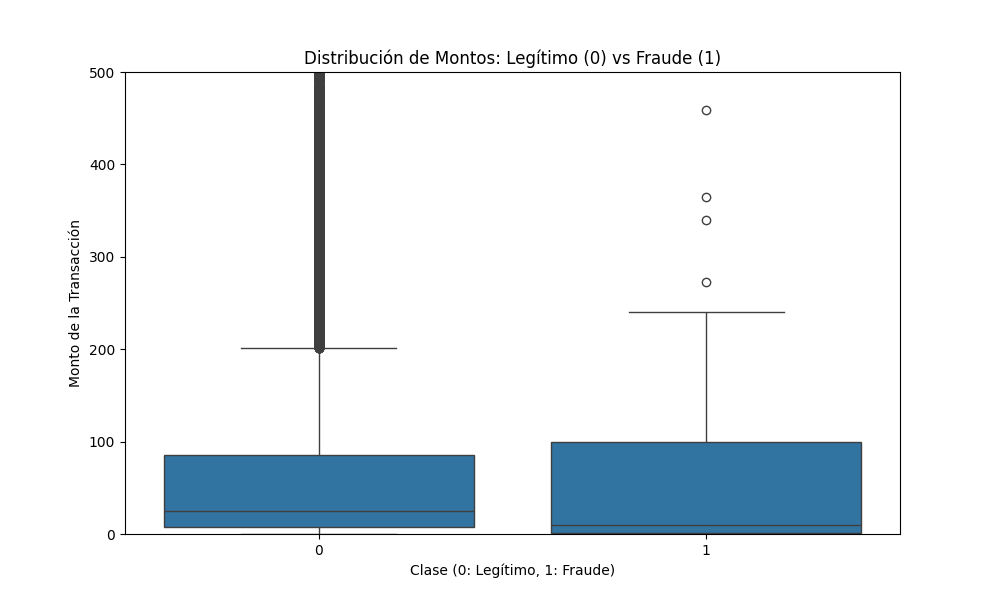

# 💳 Sistema Inteligente de Detección de Fraude Bancario

Este proyecto desarrolla un pipeline de Machine Learning de alto rendimiento para la clasificación de transacciones fraudulentas. La solución aborda uno de los desafíos más críticos en el sector financiero: el **desbalance extremo de datos**, donde los fraudes representan una fracción mínima del total de operaciones.

## 🧠 Metodología y Análisis de Datos

### 1. Análisis Exploratorio (EDA)
Como se observa en la gráfica de **Distribución de Montos**, la mayoría de las transacciones fraudulentas se concentran en montos bajos y medios (generalmente por debajo de los $200), lo que sugiere una estrategia de "micro-fraudes" para evitar disparar alertas automáticas basadas en límites de gasto. Esta característica hizo necesario un modelo capaz de encontrar patrones sutiles más allá del simple valor de la transacción.

### 2. Ingeniería de Datos y Balanceo (SMOTE)
El dataset presentaba un desbalance masivo (menos del 0.2% de casos positivos). Para evitar que el modelo se sesgara hacia las transacciones legítimas, implementamos **SMOTE (Synthetic Minority Over-sampling Technique)**. Esta técnica genera ejemplos sintéticos de la clase minoritaria (fraudes) en lugar de simplemente duplicarlos, permitiendo que el algoritmo aprenda la frontera de decisión de manera mucho más robusta.

### 3. Optimización con XGBoost y GPU
Se seleccionó el algoritmo **XGBoost** por su capacidad de manejar datos tabulares complejos. Para maximizar la eficiencia del entrenamiento, se configuró el motor de histogramas para ejecutarse sobre **arquitectura CUDA**, aprovechando la potencia de una **NVIDIA RTX 4060**. Esto permitió iterar múltiples configuraciones de hiperparámetros en una fracción del tiempo que tomaría en CPU.

## 📊 Resultados e Impacto de Negocio

El modelo fue optimizado priorizando el **Recall**, ya que en la detección de fraudes el costo de un "Falso Negativo" (un fraude no detectado) es mucho mayor al de un "Falso Positivo".

- **Recall (Sensibilidad): 97%** -> El sistema captura casi la totalidad de los intentos de fraude.
- **Precisión: 83%** -> Mantiene un equilibrio saludable para no generar demasiadas alertas falsas a los usuarios.
- **Falsos Negativos:** En el conjunto de prueba, el modelo solo omitió **1 caso**, demostrando una fiabilidad excepcional para entornos de producción.

## 🛠️ Tecnologías Utilizadas
- **Lenguaje:** Python 3.10+
- **ML Frameworks:** XGBoost, Scikit-Learn, Imbalanced-learn (SMOTE)
- **Infraestructura:** NVIDIA CUDA (Aceleración por GPU)
- **Base de Datos:** MySQL (XAMPP) para la ingesta de datos estructurados
- **Visualización:** Matplotlib & Seaborn

## 📁 Estructura del Ecosistema
- `scripts/`: Pipeline completo desde la carga de datos (`ETL`) hasta la inferencia en tiempo real.
- `models/`: Almacena el modelo entrenado y el escalador de datos para asegurar la consistencia en las predicciones.
- `data/`: Registro de transacciones (basado en el dataset de Credit Card Fraud de Kaggle).

---
**Desarrollado por Ivan Fernando Bohorquez Hernandez** *Ingeniero de Electrónica*